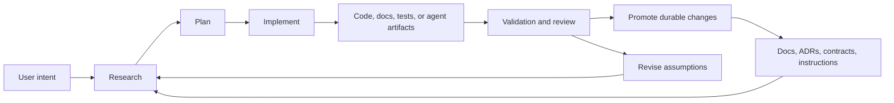
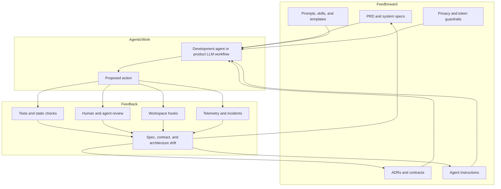

# Agentic Harnessing Framework

Owner layer: architecture.

This note describes how myHealth constrains development agents and
future product LLM workflows with feedforward and feedback mechanisms.
It is inspired by spec-driven development ideas from
[github/spec-kit](https://github.com/github/spec-kit), adapted to the
existing myHealth documentation and agent-control surface.

## Purpose

The harness exists to make agentic work inspectable. It should guide
agents before they act, observe what they changed, and promote only
durable lessons into the repository.

## Development Sequence

Substantial myHealth product implementation is intentionally sequenced
after the foundation projects that make agent-assisted development
repeatable:

1. agentic harness/control-plane foundation
2. AgentOps and token-economics observability foundation
3. myHealth product implementation on top of those foundations

This sequence is recorded in
[ADR 0009](../adr/0009_sequence_myhealth_after_agentic_foundation.md).
Until those foundations are solid enough, myHealth changes should focus
on architecture, contracts, agent-control behavior, and small validation
slices rather than broad product feature development.

## Core Dichotomy

Feedforward mechanisms shape the action before work begins:

- product requirements and architecture docs
- ADRs and contracts
- repository instructions and specialist agents
- prompts, skills, hooks, and templates
- privacy, ingestion, and token-economics constraints

Feedback mechanisms evaluate the action after or during execution:

- tests, linters, type checks, and security checks
- review findings and risk audits
- hook validation output
- architecture and contract drift checks
- operational telemetry, incidents, and user feedback

## Development-Agent Harness

This loop maps directly to working modes:

- Ask means Research.
- Plan means Plan.
- Agent means Implement.

## Feedforward And Feedback Harness

## Artifact Governance

myHealth should not collect markdown just because agents can generate
it. Each durable artifact needs a clear owner layer:

- architecture docs for system shape and service boundaries
- contracts for integration behavior and payload/state guarantees
- ADRs for durable decisions and tradeoffs
- instructions for repeatable agent behavior
- prompts and skills for reusable task execution
- local overlays for private or non-canonical project posture

Temporary research, plans, and transcripts should remain local unless a
reviewer needs them or their contents become durable source-of-truth.

## Template Boundary

Pipeline templates, GitHub Actions templates, IaC templates, and LLM
harness templates are reusable platform assets. Their canonical home is
the external `agent-instruction-control-plane` repository unless the
template defines myHealth-specific behavior that must travel with this
codebase.
